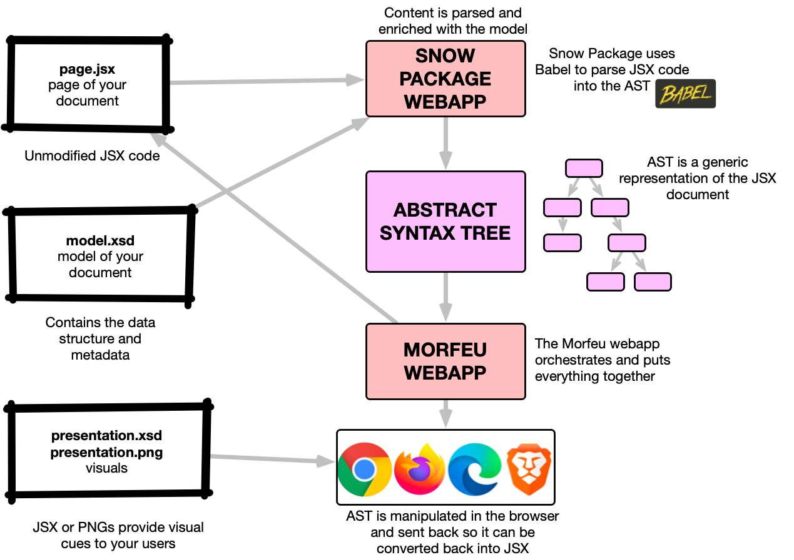

# Snow package example site
A sample website implemented in React to test with snowpackage (using JSX)

With this example website we can see the concepts Morfew and its JS compatibility service can offer for sites implemented in React and similar frameworks

Please refer to the [Morfeu](https://github.com/danigiri/morfeu) documentation for further information.

## Getting started

The easiest way is to use Docker and Docker Compose

```shell

export DOCKERIP=<your docker ip here>

# clone the repos, all from the same folder, checking out the same version
git clone https://github.com/danigiri/morfeu.git
cd morfeu && git fetch && git -c advice.detachedHead=false checkout v0.8.10 && cd ..
git clone https://github.com/danigiri/snow-package.git
cd snow-package && git fetch && git -c advice.detachedHead=false checkout v0.8.16 && cd ..

# clone the demo site
git clone https://github.com/danigiri/snowpackage-site.git
cd snowpackage-site && git fetch && git -c advice.detachedHead=false checkout v0.8.11

# start the build and the services (this will take a while), remember DOCKERIP neeeds to be 
## your docker host IP
docker-compose build --build-arg HOSTNAME=$DOCKERIP && docker-compose up

# on another window,  jump into the demo site to make live changes
docker exec -it snowpackage-site /bin/bash

# demo site code is mounted in a volume that will persist between restarts, you need to manually delete it to start from
# scratch
docker volume ls | grep site
# morfeu should be at http://DOCKERIP:8980/?config=%2Fproxy%2Fsite%2Fsnowpackage%2Fconfig.json
# demo site should be at http://DOCKERIP:3010

```

## Architecture



Morfeu presents the UI to the user, requests for JSX are routed to the Snow Package service that has the path to the JSX files in the React application.


## How it looks

# Development

    # build the morfeu library
    cd morfeu && \
        mvn package war:war install \
        -DarchiveClasses=true -DattachClasses=true -DskipITs -DskipTests=true -Djetty.skip -Dskip-build-client=true 
    
    # start morfeu pointing at the host and port where we will run the snow package app
    cd morfeu && mvn compile jetty:run \
        -D__RESOURCES_PREFIX=http://localhost:8990/ \
        -D__PROXY_PREFIX=http://localhost:8990
    
    cd snow-package && \ 
        mvn resources:resources jetty:run \
        -D__RESOURCES_PREFIX=file://$(pwd)/../snowpackage-site/src/snowpackage/ \
        -D__PROXY_PREFIX=http://localhost:3010
    
    # start the morfeu frontend
    cd morfeu/src/main/angular && ng serve --port 3000 --proxy-config proxy.conf.js --liveReload=true
    

## License

> Copyright 2020 Daniel Giribet
>
> Licensed under the Apache License, Version 2.0 (the "License");
> you may not use this file except in compliance with the License.
> You may obtain a copy of the License at

>   http://www.apache.org/licenses/LICENSE-2.0

> Unless required by applicable law or agreed to in writing, software
> distributed under the License is distributed on an "AS IS" BASIS,
> WITHOUT WARRANTIES OR CONDITIONS OF ANY KIND, either express or implied.
> See the License for the specific language governing permissions and
> limitations under the License.

